# How to send an email using Gmail API?

**Step-1)** Create an account on [Google Cloud Platform](https://cloud.google.com/)
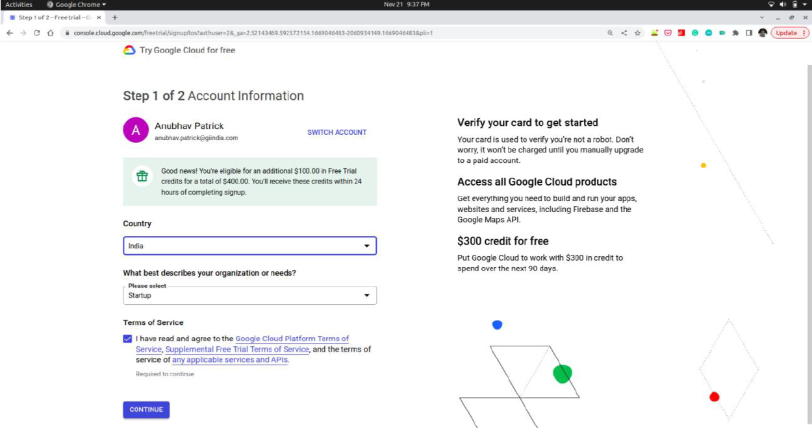
Enter the relevant details regarding to your account and complete the Google Cloud Account using your organization’s email id.
> **Note:** You do not have to provide your credit/debit card details. If it shows to provide the card details again and again, cut the window and retry.

**Step-2)** Create a new project called Gmail API Project
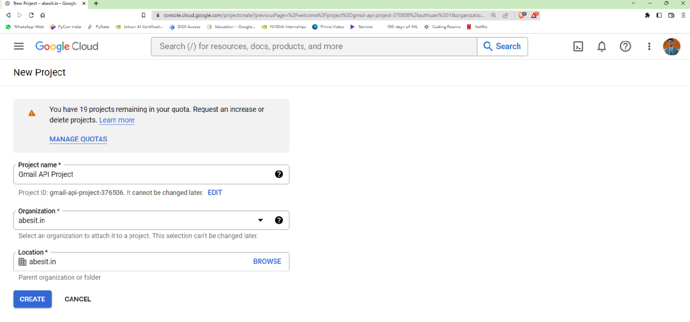

**Step-3)** Select the created project from the top pane.
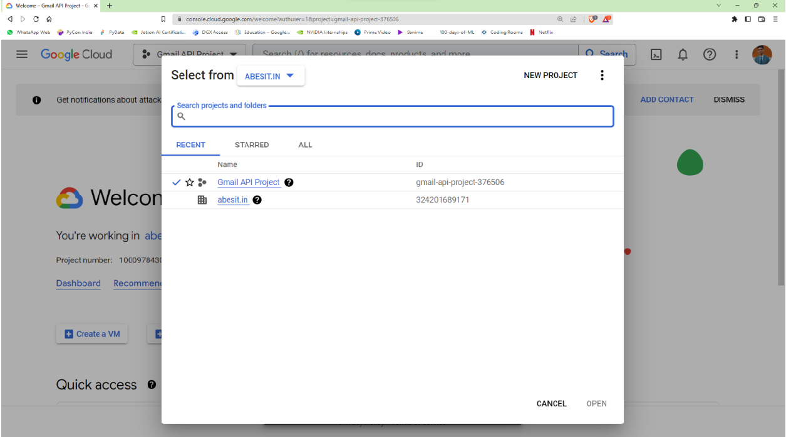

**Step-4)** Type Gmail API in the search prompt and select Gmail APi from Marketplace.
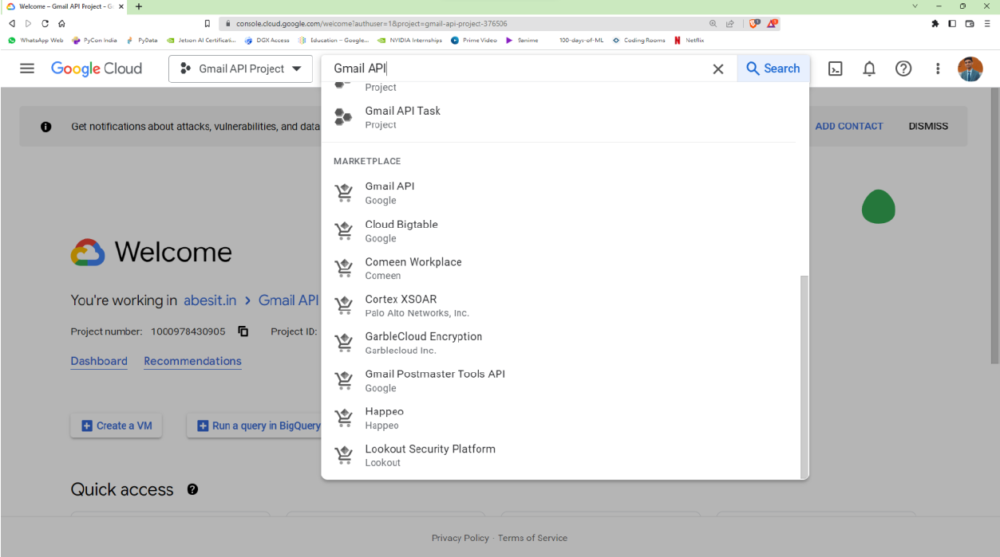

**Step-5)** Enable Gmail API
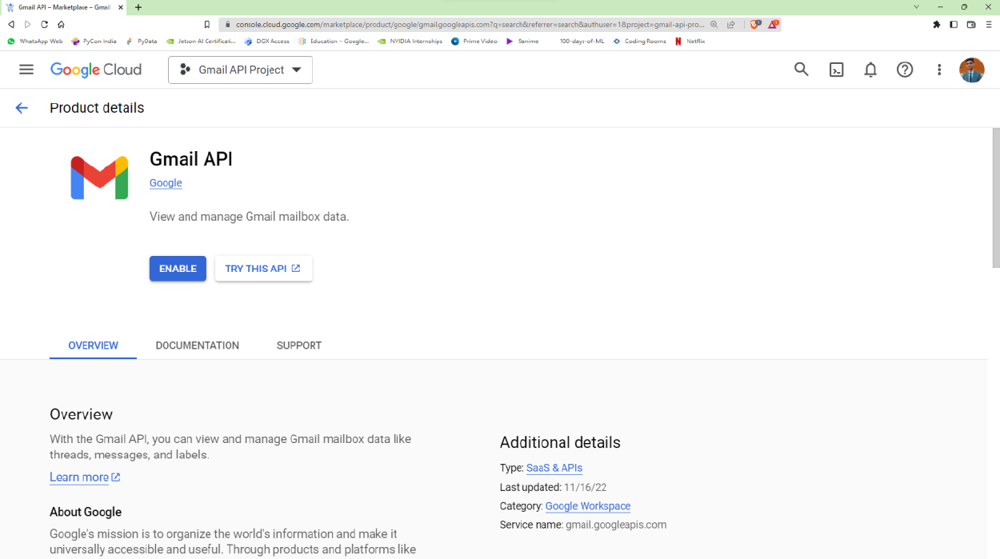

**Step-6)** Click OAuth Consent Scree from the side menu bar and select Internal.
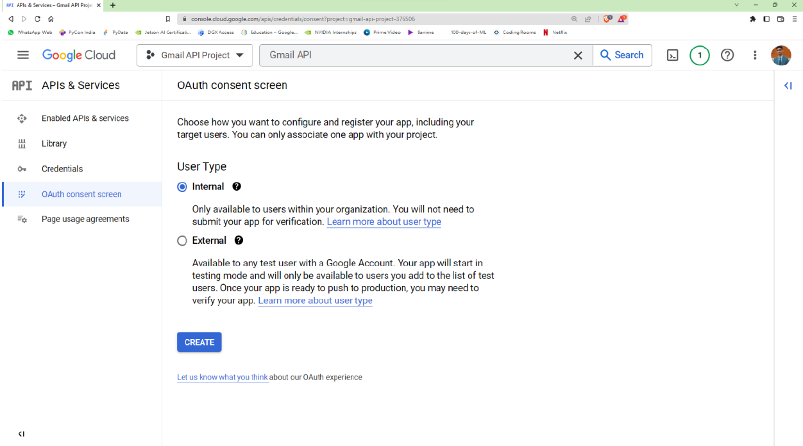

**Step-7)** Click on the Create button. Then, fill the required fields as per your project concerns.
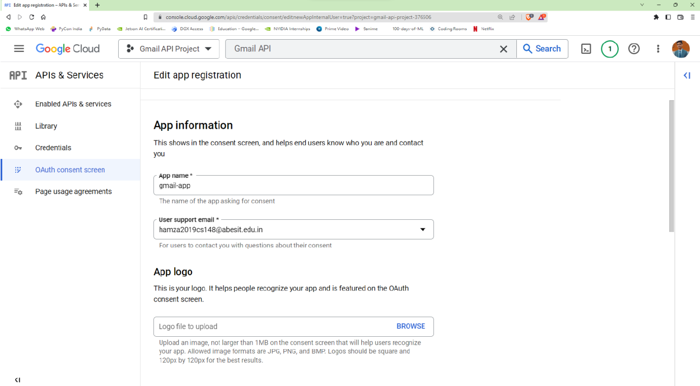

**Step-8)** Click Save and Continue, and finally Back to Dashboard. You will see a screen something like this.
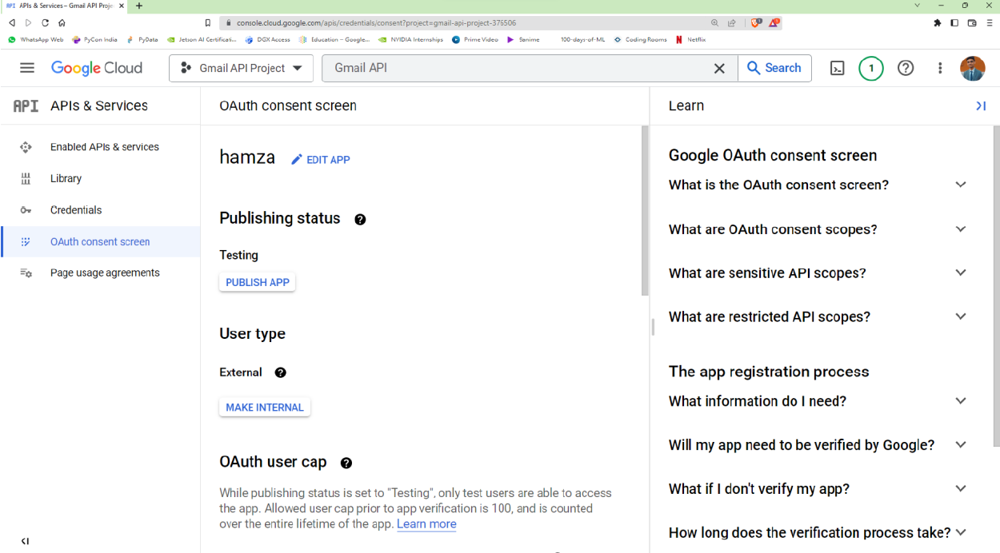

**Step-9)** Navigate to credentials window by clicking on Credentials menu from the sidebar.
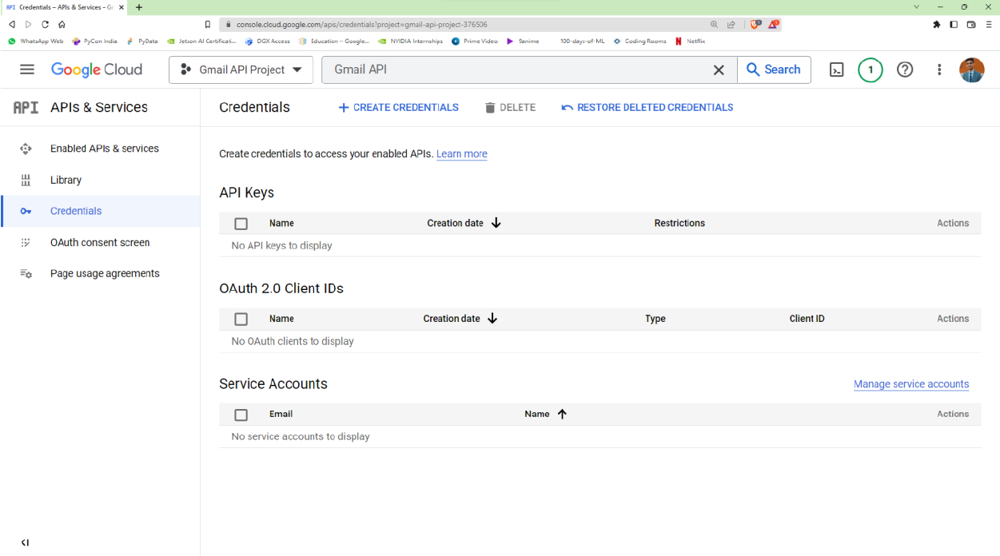

**Step-10)** Click on + CREATE CREDENTIALS and select OAuth Client ID. Select your application type and input name for your application.
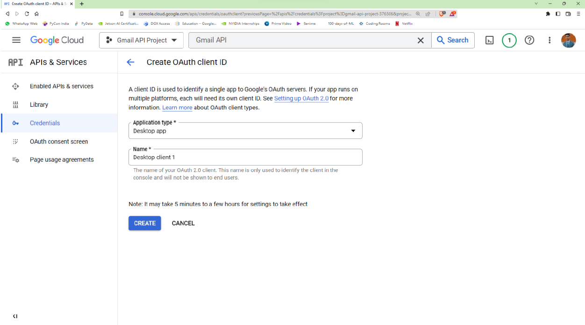

**Step-11)** Click on Create button and Download JSON.
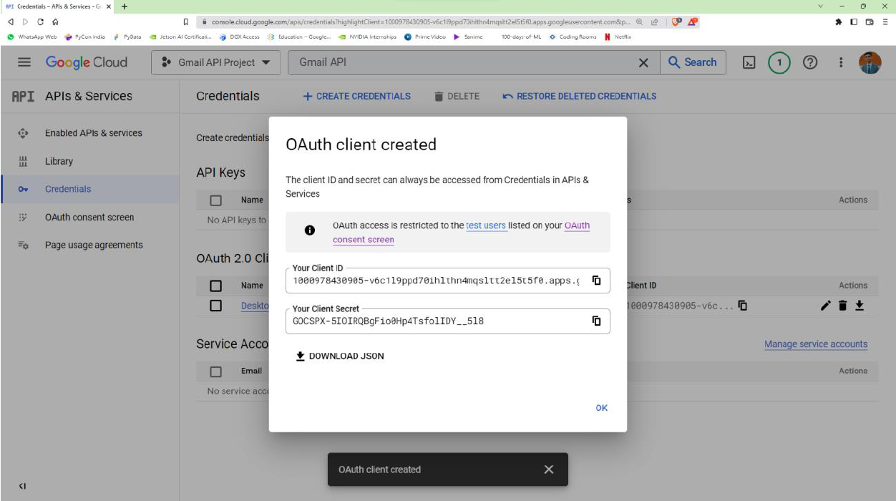

**Step-12)** Now create a project directory.
```bash
mkdir gmail_api
cd gmail_api
```

**Step-13)** Create a virtual environment and activate it.
```bash
python3 -m venv venv/
source venv/bin/activate
```

**Step-14)** Install the Google client library for Python.
```bash
pip3 install --upgrade google-api-python-client google-auth-httplib2 google-auth-oauthlib
```

**Step-15)** Move the client secret (`client_secrets.json`) downloaded in step 8 to `gmail_api/` directory and do not share this file anywhere else since your Gmail account can be accessed by anyone using these credentials.

**Step-16)** Create a new python file inside `gmail_api/` titled `send_mail.py`. This file will be used to send only text mails.
```python
"""
This module sends emails to the participants
Reference - https://developers.google.com/gmail/api/quickstart/python
"""

import os
from google.auth.transport.requests import Request
from google.oauth2.credentials import Credentials
from google_auth_oauthlib.flow import InstalledAppFlow
from googleapiclient.discovery import build
from googleapiclient.errors import HttpError
from email.mime.text import MIMEText
import base64

SCOPES = ['https://www.googleapis.com/auth/gmail.send']

def aunthentication():
	creds = None
	if os.path.exists('token.json'):
		creds = Credentials.from_authorized_user_file('token.json', SCOPES)

	if not creds or not creds.valid:
		if creds and creds.expired and creds.refresh_token:
			creds.refresh(Request())
		else:
			flow = InstalledAppFlow.from_client_secrets_file('client_secrets.json', SCOPES)
			creds = flow.run_local_server(port=0)

		with open('token.json', 'w') as token:
			token.write(creds.to_json())
	return creds
	
def prepare_and_send_email(recipient, subject, message_text):

	creds = aunthentication()
	try:

		service = build('gmail', 'v1', credentials=creds)
		msg = create_message('kshitij2020csai125@abesit.edu.in', recipient, subject, message_text)
		send_message(service, 'me', msg)

	except HttpError as error:

		print(f'An error occurred: {error}')
		
def create_message(sender, to, subject, message_text):
	message = MIMEText(message_text)
	message['from'] = sender
	message['to'] = to
	message['subject'] = subject
	return {'raw': base64.urlsafe_b64encode(message.as_string().encode()).decode()}
	
def send_message(service, user_id, message):
	try:
		message = (service.users().messages().send(userId=user_id,body=message).execute())
		print('Message Id: %s' % message['id'])
		return message
	except HttpError as error:
		print('An error occurred: %s' % error)
		
if __name__ == '__main__':
	prepare_and_send_email('kshitij.antiphishing@gmail.com', 'Greetings from Kshitij', 'This is a test email for our upcoming app.')
```
**Step-17)** Create a new python file inside `gmail_api/` titled `send_attachment.py`. This file will be used to send attachment along with text mails.
```python
"""
This module sends emails with attachments to the participants
Reference - https://developers.google.com/gmail/api/quickstart/python
"""

import os
from google.auth.transport.requests import Request
from google.oauth2.credentials import Credentials
from google_auth_oauthlib.flow import InstalledAppFlow
from googleapiclient.discovery import build
from googleapiclient.errors import HttpError
from googleapiclient.http import MediaFileUpload
from email.mime.text import MIMEText
from email.message import EmailMessage
import base64
import mimetypes

SCOPES = ['https://www.googleapis.com/auth/gmail.send']
def aunthentication():
	creds = None
	if os.path.exists('token.json'):
		creds = Credentials.from_authorized_user_file('token.json', SCOPES)

	if not creds or not creds.valid:
		if creds and creds.expired and creds.refresh_token:
			creds.refresh(Request())
		else:
			flow = InstalledAppFlow.from_client_secrets_file('client_secrets.json', SCOPES)
			creds = flow.run_local_server(port=0)

		with open('token.json', 'w') as token:
			token.write(creds.to_json())
	return creds
	
def prepare_and_send_email(recipient, subject, message_text, attachment):

	creds = aunthentication()
	try:

		service = build('gmail', 'v1', credentials=creds)
		msg = create_message('kshitij2020csai125@abesit.edu.in', recipient, subject, message_text, attachment)
		send_message(service, 'me', msg)

	except HttpError as error:

		print(f'An error occurred: {error}')
		
def create_message(sender, to, subject, message_text, attachment):
	message = EmailMessage()
	message['from'] = sender
	message['to'] = to
	message['subject'] = subject
	message.set_content(message_text)
	attachment_filename = attachment
	type_subtype, _ = mimetypes.guess_type(attachment_filename)
	maintype, subtype = type_subtype.split('/')
	with open(attachment_filename,'rb') as fp:
		attachment_data = fp.read()
	message.add_attachment(attachment_data, maintype, subtype, filename = attachment_filename)
	return {'raw': base64.urlsafe_b64encode(message.as_string().encode()).decode()}
	
def send_message(service, user_id, message):
	try:
		message = (service.users().messages().send(userId=user_id,body=message).execute())
		print('Message Id: %s' % message['id'])
		return message
	except HttpError as error:
		print('An error occurred: %s' % error)
		
if __name__ == '__main__':
	prepare_and_send_email('kshitij.antiphishing@gmail.com', 'Greetings from Kshitij', 'This is a test email for our upcoming app.', 'pig.png')
```

**Step-18)** Run the python file.
```bash
python3 send_mail.py
```
At the first time you will be prompted to enter you Google account credentials. Use the same credentials that you used to sign up in Google Cloud.
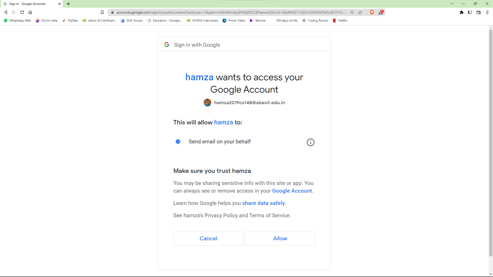# GMail-API
This API is used to send automatic emails and can be used for sending emails without using any GUI.
